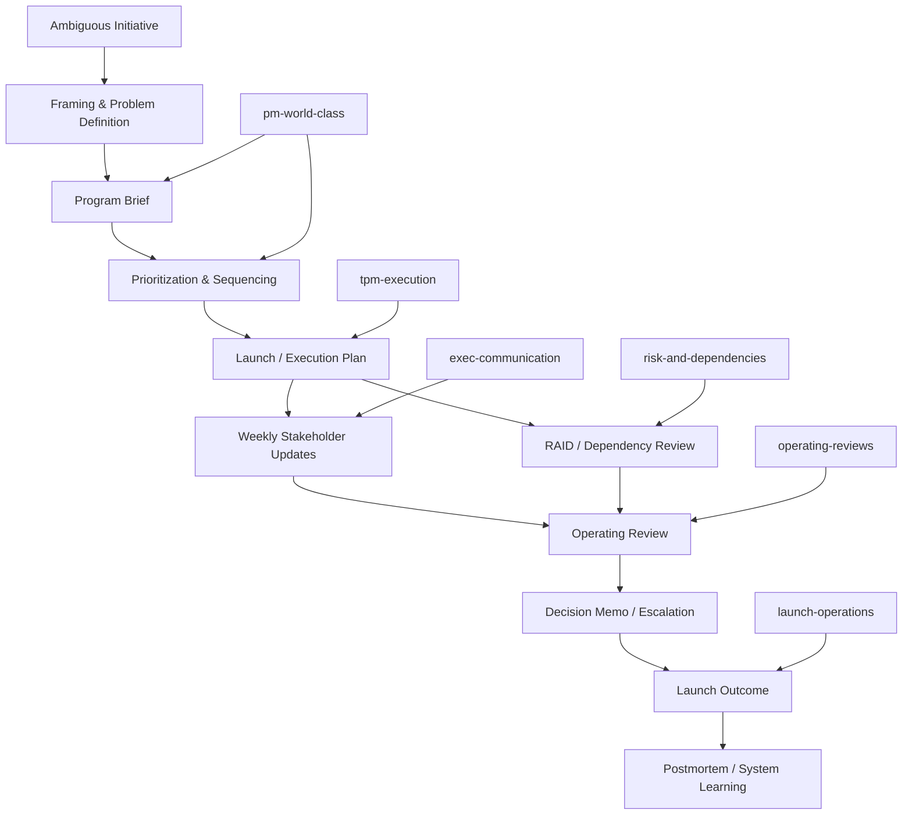

# Program Management Skills

<div align="center">

**The most ambitious public skill suite for program managers, technical program managers, and cross-functional execution leaders using Claude, Codex, Cursor, and modern AI agents.**

*Turn vague initiatives into launch plans, operating reviews, stakeholder updates, RAID logs, decision memos, portfolio summaries, and leadership-grade execution systems.*

</div>

---

## The pitch

Most AI prompt repos for PM work are shallow.

They give you:
- generic templates
- Jira-flavored theater
- Agile buzzwords
- weak writing
- no judgment under ambiguity
- no distinction between product management and program management

This repo is built to do the opposite.

**Program Management Skills** is a public, Claude-compatible skill suite for producing sharper, more credible, more useful program management artifacts.

It is designed for people doing real coordination work across product, engineering, design, data, ops, GTM, and leadership — not just filling out PM docs for appearance.

---

## Why this repo matters

Program management is one of the highest-leverage places AI can help — and one of the easiest to do badly.

Weak AI outputs in this category usually fail because they:
- bury the decision
- hide the risk
- avoid naming tradeoffs
- sound polished but say very little
- miss ownership, sequencing, and cadence
- collapse under ambiguous prompts

This suite is built around the opposite standard:
- recommendation-first communication
- execution clarity
- dependency visibility
- risk discipline
- leadership-grade concision
- reusable operating structure

---

## What makes this different

### 1. Built for **program management**, not generic PM vibes
This repo focuses on the actual work strong program leaders do:
- integrated execution planning
- launch readiness
- cross-functional sequencing
- dependency and risk management
- operating cadence design
- executive updates
- portfolio review compression
- escalation and decision hygiene

### 2. Designed for **Claude compatibility**
The skills are modular, high-signal, and easy for Claude-style systems to load incrementally.

That means:
- concise `SKILL.md` files
- deeper reference files only when needed
- structured artifact guidance
- packaged `.skill` delivery for compatible systems

See [`docs/claude-compatibility.md`](docs/claude-compatibility.md).

### 3. Better than template dumps
This is not a bag of prompts.
It is an operating system.

You get:
- artifact templates
- framing questions
- prioritization methods
- escalation logic
- risk/dependency structures
- benchmark examples
- quality bars

### 4. Built for real work under ambiguity
The suite is designed for the moment when a leader says:
- “turn this into a real plan”
- “give me the exec update”
- “what’s the risk picture?”
- “how do we launch this cleanly?”
- “what decision do I actually need to make?”

### 5. Stronger writing standard
This repo pushes AI toward outputs that are:
- tighter
- more specific
- less fluffy
- more usable in an actual org

---

## Visual system map



---

## Skill suite

### `pm-world-class`
Flagship skill for leadership-grade program artifacts.

Best for:
- program briefs
- decision memos
- strategy docs
- stakeholder updates
- KPI definitions
- postmortems
- roadmap sequencing
- RAID / operating review framing

### `tpm-execution`
For turning complex multi-team work into executable plans.

Best for:
- integrated execution plans
- milestone planning
- dependency chains
- critical path thinking
- blocker escalation

### `exec-communication`
For concise, leadership-grade updates and memos.

Best for:
- weekly executive updates
- leadership readouts
- escalation notes
- decision summaries

### `launch-operations`
For launch planning and readiness.

Best for:
- launch plans
- readiness reviews
- go/no-go checklists
- rollback planning
- comms matrices

### `risk-and-dependencies`
For making execution risk legible.

Best for:
- RAID logs
- dependency maps
- mitigation plans
- escalation thresholds

### `operating-reviews`
For portfolio and operating cadence visibility.

Best for:
- monthly operating reviews
- portfolio summaries
- initiative health compression
- variance review
- leadership action framing

---

## Who this is for

This repo is best for:
- program managers
- technical program managers
- chiefs of staff
- product ops / business ops leaders
- startup operators
- founders managing cross-functional execution
- engineering/product leaders who need stronger planning artifacts
- AI power users who want Claude to behave more like a serious program leader

---

## Example use cases

Use this suite when you want AI help with:
- writing a program brief from a fuzzy initiative
- turning a rough launch into a full execution plan
- producing a VP-ready weekly status update
- surfacing risks, assumptions, issues, and dependencies clearly
- creating an operating review across multiple initiatives
- writing a postmortem that fixes systems instead of assigning blame
- building a portfolio summary with real tradeoffs

See [`docs/use-cases.md`](docs/use-cases.md).

---

## Example transformation

### Weak AI output
> “The project is making progress and the team is working through blockers. We will continue to monitor risks.”

### Better output
- **Status:** At risk
- **What changed:** Vendor auth integration slipped 5 business days.
- **Top risk:** If unresolved by Friday, launch moves from June 12 to June 19.
- **Decision needed:** Approve temporary manual fallback by Thursday EOD.
- **Next milestone:** End-to-end staging validation Friday.

See more in [`docs/examples.md`](docs/examples.md).

---

## Why this is better than most alternatives

Short version: it is built for **execution rigor**, not just prompt aesthetics.

What you get here that you usually do not get elsewhere:
- a clearer separation between program management and product management
- stronger dependency and risk framing
- more credible escalation behavior
- better executive writing patterns
- more useful outputs from vague prompts
- a modular structure that scales well for Claude-compatible workflows

See [`docs/why-this-is-better.md`](docs/why-this-is-better.md).

---

## Search and discoverability

This repo is intentionally positioned for search intent such as:
- program management AI prompts
- Claude program management skill
- best PM prompts for Claude
- technical program manager AI prompts
- launch planning AI template
- stakeholder update template AI
- program brief template AI
- RAID log AI prompt
- operating review AI template
- AI skills for program managers

---

## Benchmarks

This suite is designed to outperform generic AI outputs on:
- clarity of recommendation
- usefulness under ambiguity
- ownership and milestone specificity
- risk visibility
- executive readability
- decision quality

See [`docs/benchmarks.md`](docs/benchmarks.md).

---

## Repo structure

```text
pm-skills-repo/
├── README.md
├── LICENSE
├── docs/
│   ├── benchmarks.md
│   ├── claude-compatibility.md
│   ├── examples.md
│   ├── repo-vision.md
│   ├── use-cases.md
│   ├── why-this-is-better.md
│   └── visuals/
│       ├── system-map.mmd
│       └── why-better.mmd
├── dist/
│   └── pm-world-class.skill
└── skills/
    └── public/
        ├── exec-communication/
        ├── launch-operations/
        ├── operating-reviews/
        ├── pm-world-class/
        ├── risk-and-dependencies/
        └── tpm-execution/
```

---

## Install / use

### Packaged skill
Use:
- `dist/pm-world-class.skill`

### Source skills
Use directly from:
- `skills/public/`

### Claude-compatible workflows
Point your system at the relevant `SKILL.md` and load the associated references as needed.

---

## Standard

If a section sounds impressive but does not improve decision quality, execution clarity, or leadership communication, it should not exist.

That is the standard for this repo.

---

## License

MIT
