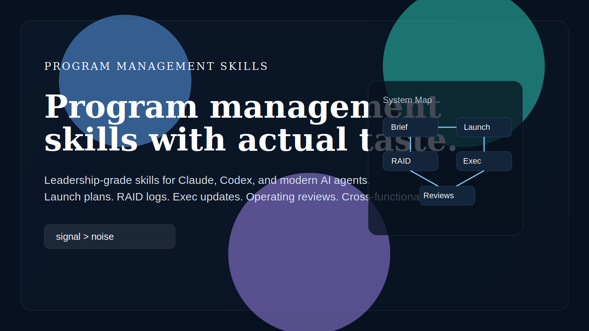
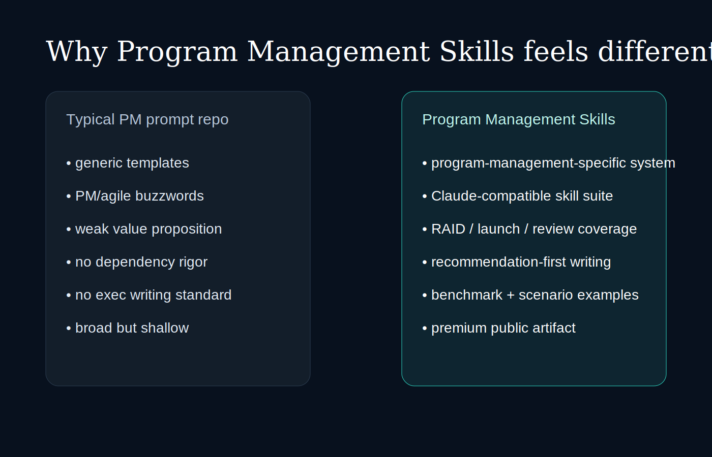
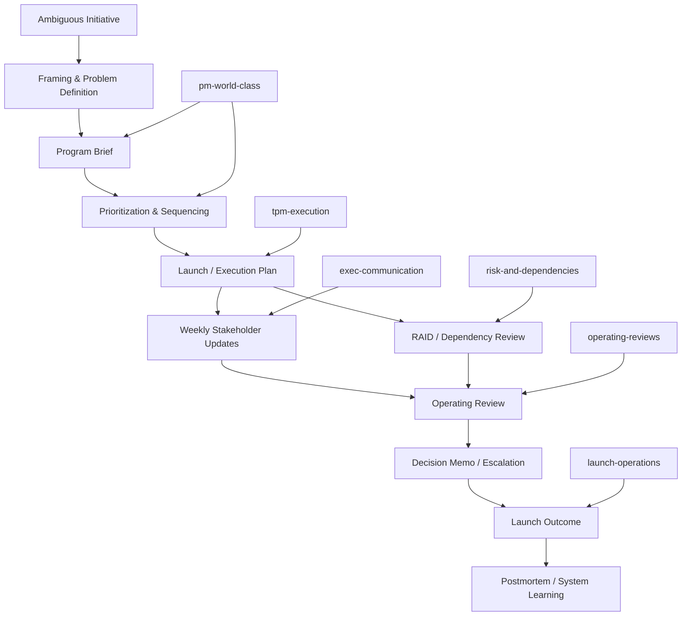

# Signal Program Systems

<div align="center">
  
</div>

<div align="center">

**Leadership-grade program management skills for Claude, Codex, Cursor, and modern AI agents.**

*The premium public skill suite for launch plans, RAID logs, operating reviews, executive updates, decision memos, and cross-functional execution systems.*

</div>

---

## What this is

**Signal Program Systems** is a high-end, public skill suite for people who lead complex work.

It helps AI produce program management artifacts that are:
- sharper
- more credible
- more executive-ready
- more useful under ambiguity
- more operationally grounded than typical PM prompt packs

This repo is built for:
- program managers
- technical program managers
- chiefs of staff
- product ops / business ops leaders
- founders and operators coordinating multi-team execution
- AI users who want Claude to write like a serious program leader

---

## Why it exists

Most PM prompt repos are weak in the places real program work matters.

They usually have:
- generic templates
- agile/process theater
- shallow value props
- weak writing taste
- poor handling of risks and dependencies
- no real distinction between product management and program management
- no premium public presentation

Signal Program Systems is built to be the opposite.

It is designed around one standard:

> **If it does not improve decision quality, execution clarity, or leadership communication, it should not exist.**

---

## Why it is different

### Program-management-native
This suite is explicitly built for:
- cross-functional execution
- launch readiness
- risk and dependency management
- operating cadences
- executive communication
- portfolio compression
- escalation and decision hygiene

### Claude-compatible by design
The repo is structured as modular AgentSkills with clean `SKILL.md` files and deeper `references/` docs only when needed.

That makes it well suited to Claude-style skill workflows as well as Codex/Cursor-style agent systems.

### Better than prompt dumps
Most repos in this category are just collections of prompts.
This is an **operating system**.

You get:
- skills
- templates
- framing questions
- quality bars
- benchmark examples
- visual system maps
- scenario packs
- install/use guidance

### Higher taste level
This repo is biased toward:
- concise executive writing
- explicit tradeoffs
- real ownership and sequencing
- less filler
- stronger escalation behavior
- more useful outputs from vague inputs

---

## Visual system map

<div align="center">
  
</div>



---

## Skill suite

### `pm-world-class`
The flagship skill for leadership-grade program artifacts.

Best for:
- program briefs
- decision memos
- strategy docs
- stakeholder updates
- KPI definitions
- postmortems
- roadmap sequencing
- operating review framing

### `tpm-execution`
For turning complex multi-team work into executable plans.

Best for:
- integrated execution plans
- milestone planning
- dependency chains
- critical path thinking
- blocker escalation

### `exec-communication`
For concise, leadership-grade updates and memos.

Best for:
- weekly executive updates
- leadership readouts
- escalation notes
- decision summaries

### `launch-operations`
For launch planning and readiness.

Best for:
- launch plans
- readiness reviews
- go/no-go checklists
- rollback planning
- comms matrices

### `risk-and-dependencies`
For making execution risk legible.

Best for:
- RAID logs
- dependency maps
- mitigation plans
- escalation thresholds

### `operating-reviews`
For portfolio and operating cadence visibility.

Best for:
- monthly operating reviews
- portfolio summaries
- initiative health compression
- variance review
- leadership action framing

---

## Example transformation

### Weak AI output
> “The project is making progress and the team is working through blockers. We will continue to monitor risks.”

### Better output
- **Status:** At risk
- **What changed:** Vendor auth integration slipped 5 business days.
- **Top risk:** If unresolved by Friday, launch moves from June 12 to June 19.
- **Decision needed:** Approve temporary manual fallback by Thursday EOD.
- **Next milestone:** End-to-end staging validation Friday.

More examples:
- [`docs/examples.md`](docs/examples.md)
- [`docs/benchmarks.md`](docs/benchmarks.md)

---

## Scenario pack

This suite is designed to handle real high-value scenarios such as:
- AI platform launches
- marketplace reliability programs
- enterprise migrations
- SaaS onboarding launches
- internal tooling rollouts

See [`docs/scenario-pack.md`](docs/scenario-pack.md).

---

## Search / discoverability targets

This repo is intentionally built to rank and be discoverable for searches like:
- program management AI prompts
- Claude program management skill
- best PM prompts for Claude
- technical program manager AI prompts
- launch planning AI template
- program brief template AI
- stakeholder update template AI
- RAID log AI prompt
- operating review AI template
- AI skills for program managers

---

## Install / use

See [`docs/install.md`](docs/install.md).

Quick version:
- packaged artifact: `dist/pm-world-class.skill`
- source skills: `skills/public/`
- Claude-compatible usage: load the relevant `SKILL.md`, then pull in only the reference docs needed for the artifact you want

---

## Why this is better than most alternatives

Short version:
- stronger value proposition
- stronger writing taste
- stronger execution rigor
- stronger program-management specificity
- stronger public presentation
- stronger compatibility with modern agent systems

Read more:
- [`docs/why-this-is-better.md`](docs/why-this-is-better.md)
- [`docs/claude-compatibility.md`](docs/claude-compatibility.md)
- [`docs/landscape.md`](docs/landscape.md)

---

## Repo structure

```text
signal-program-systems/
├── README.md
├── LICENSE
├── docs/
│   ├── benchmarks.md
│   ├── brand.md
│   ├── claude-compatibility.md
│   ├── examples.md
│   ├── install.md
│   ├── landscape.md
│   ├── repo-vision.md
│   ├── scenario-pack.md
│   ├── use-cases.md
│   ├── why-this-is-better.md
│   └── visuals/
│       ├── comparison.svg
│       ├── hero.svg
│       ├── system-map.mmd
│       └── why-better.mmd
├── dist/
│   └── pm-world-class.skill
└── skills/
    └── public/
        ├── exec-communication/
        ├── launch-operations/
        ├── operating-reviews/
        ├── pm-world-class/
        ├── risk-and-dependencies/
        └── tpm-execution/
```

---

## Standard

If a section sounds impressive but does not improve:
- decision quality
- execution clarity
- leadership communication
- risk visibility
- launch readiness

it should be cut.

That is the standard for Signal Program Systems.

---

## License

MIT
